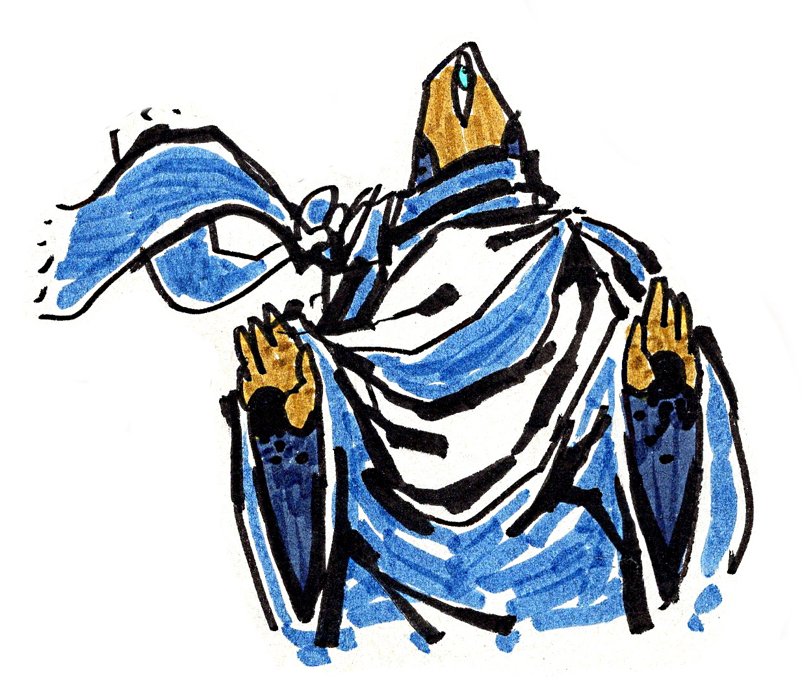

Bonjour,

Je voulais tester la nouvelle fonctionnalité de [`motifs-js`](https://github.com/Skaant/motifs-js) version `0.4.0` qui permet d'ajouter des images aux articles.

Voici donc une illustration d'un "chercheur du un", **symbolisé par son oeil unique positionné au centre du visage**.

Cet oeil représente l'élévation au-delà du stade de la dualité, que l'on trouve dans les formes "visibles" avec nos deux yeux "normaux".

Sur ce, bonne recherche et belle journée à vous :)